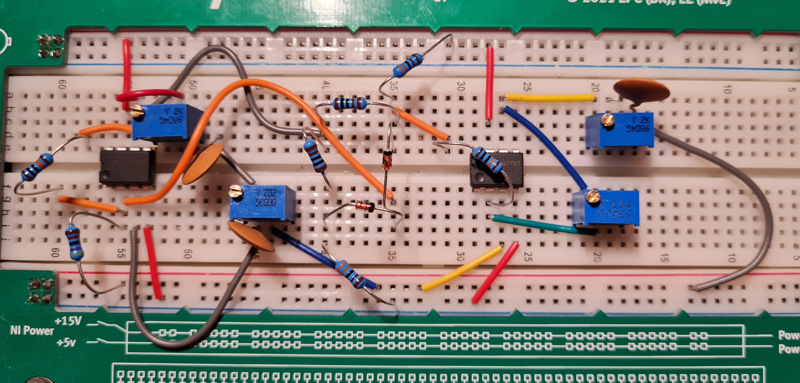

# Electric Circuits 2: Adjustable 10 kHz Sine Oscillator

Design, simulation and breadboard implementation of a low-distortion sine wave oscillator
at 10 kHz with an output amplitude adjustable from 0 to 5 Vpp. Built as the individual
design project for the TU/e course Electric Circuits 2 (5ECC0). The work goes from
comparing oscillator architectures, through analytical component sizing and circuit
simulation, to a physical prototype measured on the bench and compared against the
predicted behaviour.

The prototype above uses two op-amps, trimmer potentiometers for tuning the frequency
network and the amplitude, resistors and capacitors for the RC Wien bridge, and diodes for
amplitude stabilization, all built on an NI ELVIS breadboard.

## What was done

- Architecture comparison. Three oscillator types were weighed for frequency stability,
  waveform purity and complexity: an RC phase-shift oscillator, an LC oscillator, and a
  Wien-bridge oscillator. The Wien bridge was chosen for its clean sine output and simple
  frequency setting.
- Design and analysis. The RC frequency-selective network sets the 10 kHz oscillation
  frequency (matched 10 nF capacitors with resistors around 1.2 k). An op-amp amplifier
  provides the loop gain, a second stage gives adjustable output amplitude, and a diode
  pair stabilizes the amplitude so the loop gain settles just above the oscillation
  condition instead of clipping.
- Harmonic suppression. A filter stage was added to reduce the harmonic content of the
  output, which is the main innovation of the project. The measurements below show the
  effect of the filter on the spectrum.
- Simulation. The circuits were built and simulated in Qucs. Alongside the final Wien
  bridge, the repository keeps the earlier alternatives (a transistor LC oscillator and a
  transistor low-frequency RC oscillator) and a larger test schematic with transient
  analysis used while iterating the design.
- Measurement. The breadboard prototype was measured with a LabVIEW-based instrument. The
  output waveform, output amplitude and harmonic distortion were captured at several
  amplitude settings, with and without the harmonic-suppression filter.

## Measured results

| Measured output at 5 Vpp | Output spectrum at 5 Vpp |
| --- | --- |
|  |  |

The left capture shows a clean sine at 10.04 kHz and 5.019 Vpp. The right capture shows the
power spectrum with the fundamental near 10 kHz, the harmonics well below it, and a measured
total harmonic distortion of 0.96 percent. The repository also holds the same measurements
at 0.5, 1 and 2 Vpp, and the without-filter captures for comparison.

## Contents

| Path | Role |
| --- | --- |
| `wien-bridge-oscillator-5ecc0.sch` | Qucs schematic of the final Wien-bridge oscillator: two op-amps, the RC frequency network, gain control and diode amplitude stabilization. |
| `wien-bridge-oscillator-5ecc0.dat`, `wien-bridge-oscillator-5ecc0.dpl` | Qucs simulation dataset and data-display for the final design. |
| `classic-oscillator/` | Qucs schematic and data for a transistor LC oscillator considered as an alternative. |
| `oscillator/` | Qucs schematic and data for a transistor low-frequency RC oscillator considered as an alternative. |
| `test/` | Larger test schematic with transient analysis used while iterating the design. |
| `circuit.jpg` | Photo of the breadboard prototype (shown above). |
| `amp final 5vpp.png`, `amp final 2vpp.png` | Measured output waveform with the filter, at 5 and 2 Vpp. |
| `amp no-filter 5vpp.png` | Measured output waveform without the filter, at 5 Vpp. |
| `freq 0.5vpp.png`, `freq 1vpp.png`, `freq 2vpp.png`, `freq 5vpp.png` | Measured output spectra with the filter, at 0.5, 1, 2 and 5 Vpp. |
| `freq no-filter 5vpp.png` | Measured output spectrum without the filter, at 5 Vpp. |
| `Report_5ECC0.pdf` | Full project report: literature review, architecture comparison, analysis, design, simulations and measurements. |

## Opening the schematics

The `.sch`, `.dat` and `.dpl` files are Qucs (Quite Universal Circuit Simulator) files. Open
a `.sch` in Qucs to view or run the circuit; the matching `.dpl` opens the data display with
the simulation results.

## Technologies

- Qucs for schematic capture and simulation
- LabVIEW-based bench instrument for waveform and harmonic-distortion measurement
- Op-amp Wien-bridge oscillator with diode amplitude stabilization and a harmonic-suppression filter
